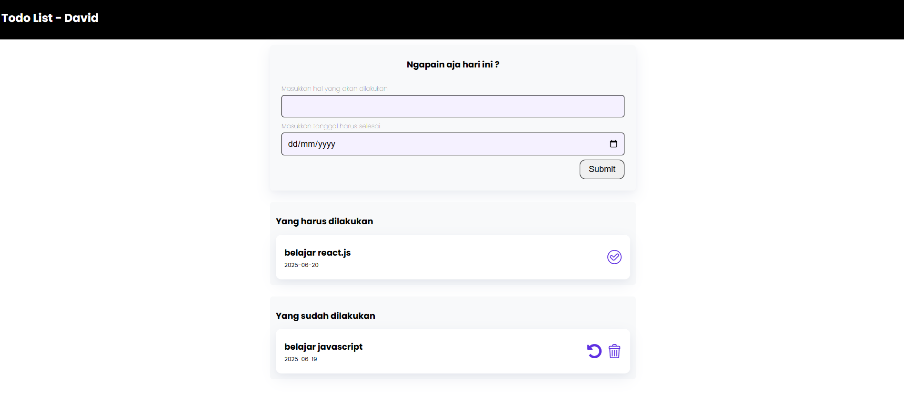

# 📝 To-Do List App with LocalStorage

To-Do List sederhana berbasis HTML, CSS, dan JavaScript vanilla. Aplikasi ini memungkinkan pengguna menambahkan daftar tugas, memindahkannya ke daftar selesai, membatalkan, dan menghapus tugas. Data disimpan menggunakan `localStorage` agar tidak hilang saat browser ditutup.

---

## Fitur Utama

- Tambah tugas baru dengan tanggal
- Pisahkan tugas `Belum Selesai` dan `Sudah Selesai`
- Pindah tugas ke selesai dan sebaliknya
- Hapus tugas dari daftar
- Simpan otomatis ke **LocalStorage**
- Tidak butuh backend atau database eksternal

---

## Tampilan Aplikasi

> _Gambar di atas adalah contoh tampilan utama aplikasi_

---

## Teknologi yang Digunakan

- HTML5
- CSS3
- JavaScript (DOM & Event Listener)
- LocalStorage API

---
